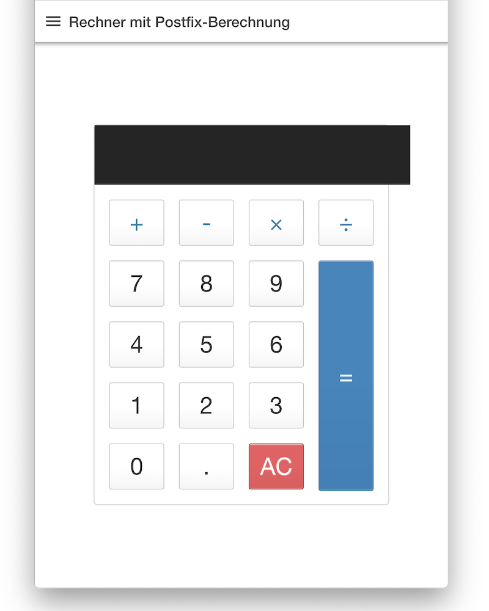
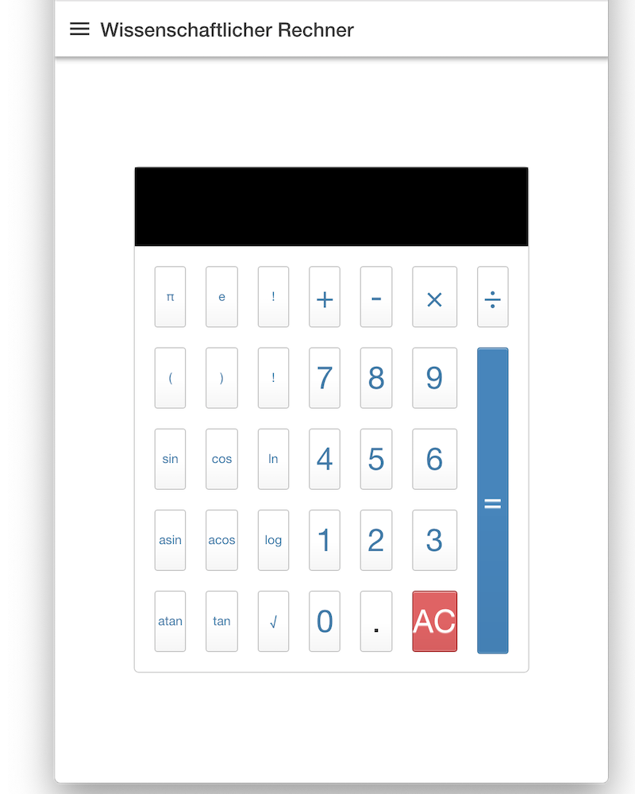

# Calculators with Ionic 4

Simple Ionic project to demonstrate how to build a calculator app.

This means:
- working with css and grid to setup a nice display of a calculate
- working with typescript to handle the evaluation 

Basic Calculator | Postfix Calculator | Scientific
---------------- | ------------------ | ---------------------
 |  | 

Working with the math.js module for better precision

    npm install mathjs --save
    npm install @types/mathjs --save-dev
